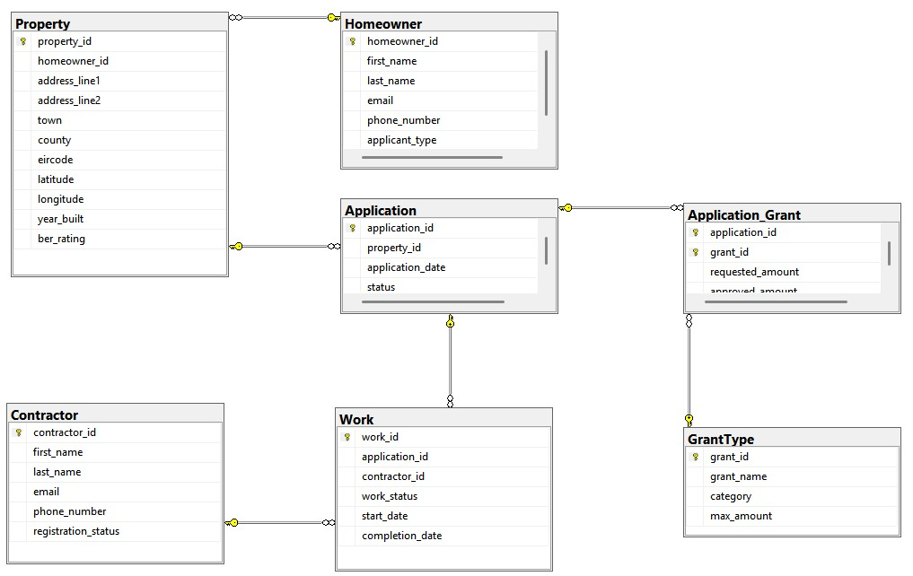
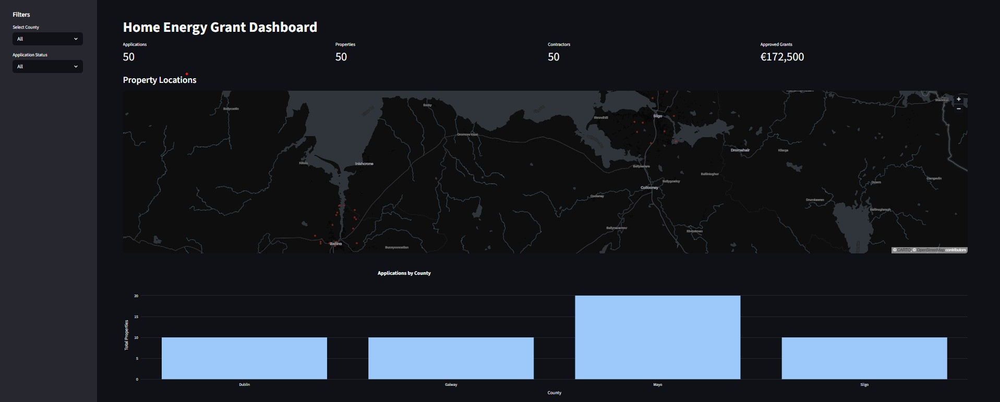
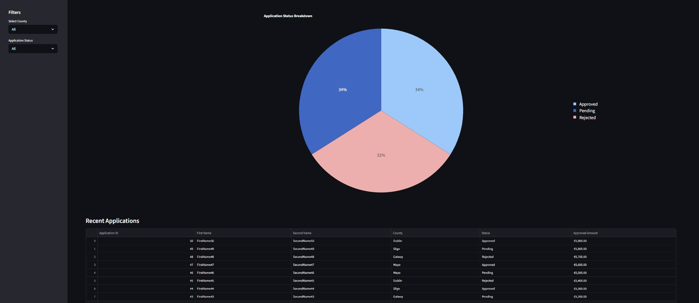

# Home Energy Grant Management System

A SQL Server and Python-based energy grant management system with an interactive Streamlit dashboard for visualising applications, properties, grants and contractor activity across Ireland.

## Features

* SQL Server relational database design
* Multi-table schema with foreign key relationships
* Interactive Streamlit dashboard
* Ireland property map using latitude and longitude coordinates
* KPI dashboard cards
* Interactive county filtering
* Plotly data visualisations
* Application status breakdown charts
* Styled application reporting table
* Dummy data generation for testing and analytics

## How it works

The project uses SQL Server as the backend relational database and Streamlit as the frontend dashboard framework.

The database schema was designed using a relational structure with primary keys, foreign keys, constraints and a junction table to model many-to-many relationships.

## Database Relationships

* One homeowner can own multiple properties
* Each property has one homeowner
* Each property can have multiple applications over time
* Each application belongs to one property
* Each application can include multiple grants
* Each grant can appear in multiple applications
* Approved grant amounts are stored per application per grant
* One work record is carried out by one contractor
* A contractor can perform multiple work records
* Latitude and longitude are stored for visualisation purposes

## Database Structure

The system contains the following core tables:

* Homeowner
* Property
* Application
* Application_Grant
* GrantType
* Contractor
* Work

## Schema Features

* Primary keys used throughout
* Foreign key constraints enforce relational integrity
* Junction table used for many-to-many grant relationships
* Composite primary key used in Application_Grant table
* Approved and requested grant amounts stored at junction table level
* Eircode validation using SQL CHECK constraints
* BER rating validation using SQL CHECK constraints
* Unique constraint applied to property Eircodes
* Decimal coordinate storage for Ireland map visualisation

## ER Diagram



## Dashboard Preview

### Main Dashboard



### Analytics and Reporting



## Usage

### 1. Create Database

Run:

schema.sql

### 2. Insert Dummy Data

Run:

dummy_data.sql

### 3. Install Required Python Packages

```bash
pip install streamlit pandas pyodbc plotly
````

### 4. Run Dashboard

```bash
python -m streamlit run dashboard.py
```

## Notes

* Uses SQL Server Express with Windows Authentication
* Dashboard connects directly to SQL Server using pyodbc
* Streamlit used for frontend dashboard interface
* Plotly used for interactive charts and graphs
* Pandas used for SQL data processing and manipulation
* Designed as a portfolio project for SQL, Python and dashboard development practice